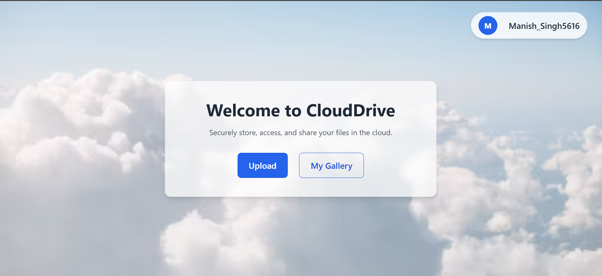
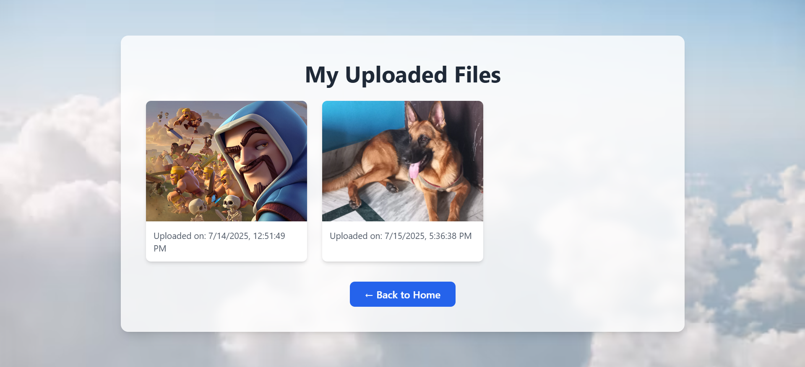

# ☁️ CloudDrive

**CloudDrive** is a secure, full-featured personal cloud file manager built using modern web technologies like **Node.js**, **Express**, **MongoDB**, and **Cloudinary**. Users can sign up, log in, upload images, and browse their own private gallery — all within a sleek and responsive UI.

> "Your cloud. Your control. Store smarter, live freer."

---

## ✨ Highlights

- 🌐 **Deployed and Live** — accessible from anywhere
- 🔐 **Secure Auth** — register/login with JWT and encrypted passwords
- ☁️ **Cloud Storage** — uploads go directly to Cloudinary, not your server
- 🖼️ **Private Gallery** — each user sees only their own uploaded files
- 📥 **Modal View & Download** — click images to enlarge and download instantly
- 🎨 **Modern UI** — Tailwind CSS + Flowbite for smooth design and components
- ⚙️ **Robust Backend** — built with Express.js and MongoDB using Mongoose
- 💡 **Error Handling & Validation** — user feedback and edge-case protection

---

## 🔧 Tech Stack

| Layer        | Technology                     |
|--------------|--------------------------------|
| **Frontend** | EJS, Tailwind CSS, Flowbite    |
| **Backend**  | Node.js, Express.js            |
| **Database** | MongoDB (with Mongoose)        |
| **Auth**     | JWT, bcrypt                    |
| **Storage**  | Cloudinary (image hosting)     |
| **Deploy**   | GitHub + Render                |

---

## 🚀 Live Demo

🌍 **URL**: [https://cloud-drive-jmmt.onrender.com/](https://cloud-drive-jmmt.onrender.com/)

---

## 📷 Screenshots

| Home Page | Upload Popup | My Files |
|-----------|--------------|----------|
|  |  |  |

---

